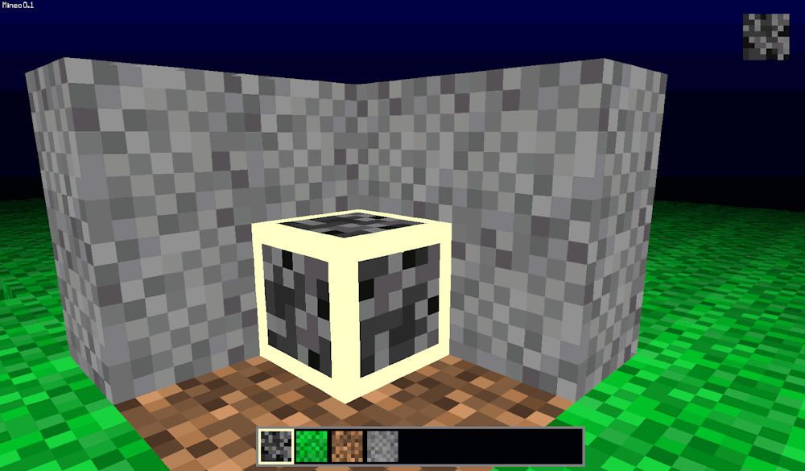

# Mineo Java

**Mineo Java** is a voxel sandbox game currently in early Alpha.

It is obviously heavily inspired by *Minecraft* and aims to emulate much of its functionality but built from scratch with no dependencies.

Java 17 is required to run the game.
